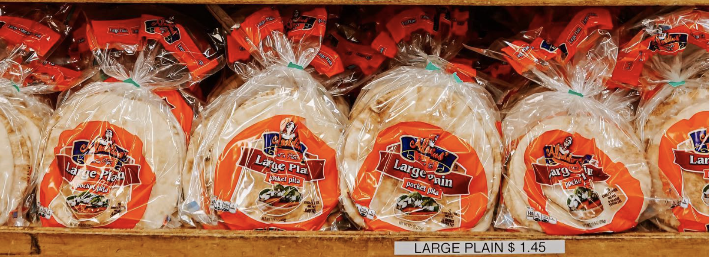

# Predicting Pita Bread Sales at Family Bakery to Improve Orders Accuracy

<figure>
    

    
    

</figure>

### by John Nahra

# Overview

My grandfather started a bakery in downtown Cleveland with his brother and his cousin over 50 years ago. They built up the business to be very successful and a Cleveland staple. It is a source of family pride, appreciation for my Lebanese roots, and delicious Mediterranean food!

The business has now passed onto the sons, my dad and his cousins, and is continuing to thrive. Still, businesses always have room for improvement. In talking with my dad, he identified a project centered around inventory management as a useful enterprise. In particular, the inventory management of pita bread in the store front. As the grandson of one of Aladdin's founders and its first data scientist, I jumped at the opportunity to help my family in a real-world capstone project.

The large majority of the business is baking pita bread that is then distributed to grocery stores. However, we also sell pita bread out of the store front, both to retail and wholesale customers. The store manager places bread orders five times per week for fresh bread to be baked and sold at the store the next day (or two). In its current state without using data, orders are more feel-driven.

The impetus behind the project is to see if we can use data to better match orders to sales, thereby reducing the amount of bread that must be discounted as day-old bread or discarded while at the same time ordering enough such that all who want delicious fresh pita bread are able to buy it.

There are several types of bread ordered, baked, and sold each day, but for the purposes of this project I focused only on one bread type: large plain pita bread.

Using daily data on store front transactions from January 2021 to March 2023, I ran a time series model to predict daily bread sales. I compared my sales predictions with the store front's bread orders over that same time frame and found that my predictions reduced the daily average order error by 25 and 33 packages of pita as compared with current orders on the train and test sets, respectively.

My 2023 sales forecast can be found in ['data/future_forecast.csv'](https://github.com/jnahra/capstone-project/blob/main/data/future_forecast.csv).

# Data Understanding

As mentioned above, I used daily data on store front transactions from January 2021 to March 2023. The data contained characteristics of each individual customer purchase: date, item, quantity, price, etc.

I filtered for large plain pita bread sales only. I split those sales into retail and wholesale categories and modeled each category separately.

Retail represents regular foot traffic. In the case of large plain pita, retail also represents customers who buy sandwiches, since large plain is used to make our shawarma wraps. Each package of pita contains five pieces of pita, thus five sandwiches is equivalent to one package of pita.

Wholesale represents some of our wholesale customers who walk into the store front to buy bread. Generally, customers wanting more than 3 trays of bread (18 packages per tray, so 54 packages of pita) need to order ahead of time. Thus, I assumed in my model that any sale over 54 packages of pita would be known ahead of time. Most of these customers are wholesale customers, but there were a few retail customers who bought a large amount of bread as well.

For a baseline comparison, I utilized daily data on the store front's bread orders from January 2021 to March 2023. This data contained order characteristics such as date, customer ID, bread type, quantity, sale cost, etc.

For my more complex time series model with additional regressors, I added variables for Cleveland Guardians day home games and Cleveland weather features.

Aladdin's Baking Company is only a short walk from Progressive Field, the home of Cleveland's MLB franchise, so I wanted to see if pita sales were affected on days when the Guardians had a home game during the day time (defined as a game starting before 7 pm). It serves to reason that there may be some effect when there is greater foot traffic downtown (at least for sandwiches), though it could also dissuade would-be non-game-going customers from making the trip due to increased traffic. I utilized data from Baseball Reference to put together the Guardians home schedule from 2021-2023 (including playoffs), filtered for day games, and used game attendance as the variable. More fans, more foot traffic is the theory.

I also wanted to see if Cleveland weather could provide a more accurate, granular sales forecast outside of general annual seasonality. I gathered daily weather data from the National Oceanic and Atmospheric Administration for Cleveland Hopkins Airport, which is about 15 minutes away from the bakery. I was able to get features such as precipitation and snowfall in inches as well as maximum temperature for each day.

# Modeling

Looking at my data, I noticed there was both weekly and annual seasonality. Holidays also have a significant impact on sales. Sometimes because of the effects they have consumer behavior, other times because the bakery isn't open!

I found a time series model created by Facebook called Prophet, which allows for easy incorporation of multiple seasonalities, holidays, and additional regressors. It also has a visual breakdown of how much variability in the overall series can be accounted for by the trend, seasonalities, holidays, and additional regressors.

I ran two models each for retail sales and wholesale sales. The first model included weekly and annual seasonality as well as holidays. For holidays, I used all major U.S. public holidays as well as Ramadan, a Muslim holiday that includes a month of fasting (not great for pita bread sales!). The second model added the Guardians' day home game attendance and Cleveland weather conditions such as maximum temperature, precipitation, and snowfall.

The time series model required two years of training data for annual seasonality purposes, so my train set was January 2021-January 2023 and my test set was January 2023-March 2023. The small test size represents a limitation in my model evaluation.

Ultimately, the first model without regressors performed the best for both retail and wholesale sales. There may have been a very slight improvement adding the regressors, but I deemed the additional complexity of the model not worth the minimal improvement. A simpler model that does not require daily weather inputs is also more feasible for real-world model deployment. I can simply give the store manager my complete 2023 forecast, which he can put into action without any additional ongoing work required.

After selecting my model, I re-trained the model with all the data (train and test set) for retail and wholesale sales. I then replaced any negative predictions with zero before adding retail and wholesale sales together for my final forecast of total daily pita bread sales for transactions equal to or below 54 packages of pita. The store manager can add in large orders as they become known.

# Evaluation

Now that I have determined the best time series model, the real test: is my sales forecast model better than current orders? In order to make that comparison, I attempt to compare apples to apples. Orders are placed five times per week, so I manipulate my daily sales forecast to match the form of the orders. As per the store manager, I assume any order over 54 packages of pita will be known ahead of time, and thus I add in those orders to my model as if I had predicted them with 100% accuracy.

This may be overly generous, as it does not appear that the storefront always orders as if they knew large orders were coming. However, strangely the sales are still made on those days. More digging may be required on this front. Fortunately, it's likely not only one-sided, as there are also likely smaller orders known ahead of time by the store front that my model is forecasting.

Indeed, one data limitation is that I don't know how many/which sales are known ahead of time, which would be useful in determining what I need to model and in comparing my model to current orders. But we can only go off what we know.

A comparison between my model and current orders on the test set showed my model represented a substantial improvement. My model was off on average by 42 packages of pita daily versus 75 packages of pita for current orders.

# Recommendations & Future Insights

My model prediction represents a data-driven improvement over current orders and can be deployed immediately for the rest of 2023. Large sales for both retail and wholesale can be added in as they become known.

This model is ready to go and can help right now, but what can be done in the future to continue helping the bakery and improving this model? First, we can expand the model to other bread types. It is likely that my model can improve ordering for other bread types as well. Second, we can keep tracking our model’s performance for a larger test set (both the simple and advanced models). We can also periodically retrain the model as we get more data. Lastly, we can look into determining whether over-ordering (selling discounted bread and discarding old bread) or under-ordering (missing out on potential sales) is more costly for the business. This can inform how we assess the model's performance.

I am proud to be able to help the business my grandfather started over 50 years ago using tools I learned a few months ago. Hopefully the first project of many!

